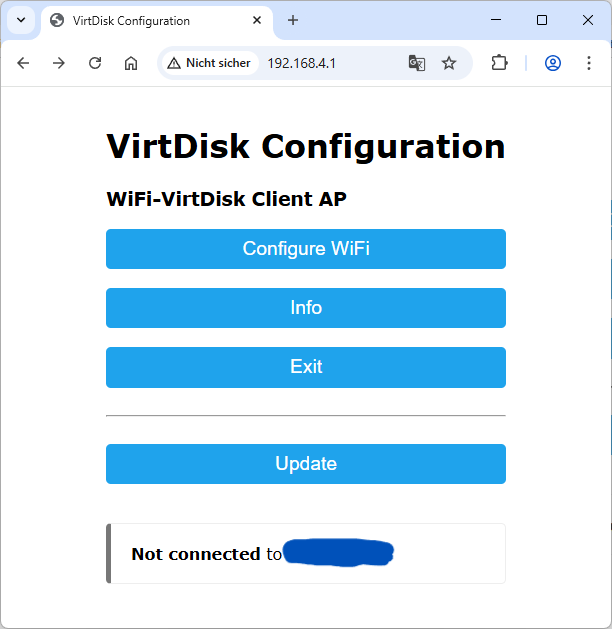
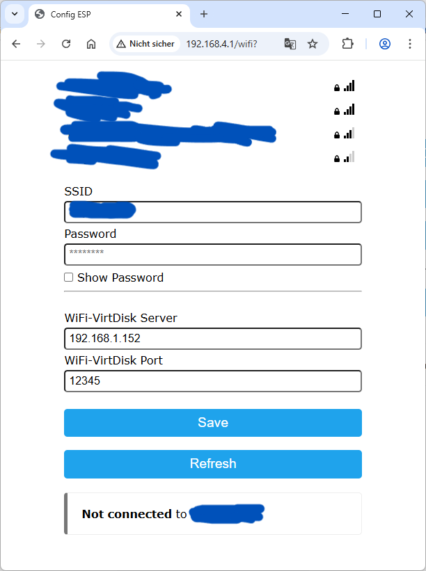
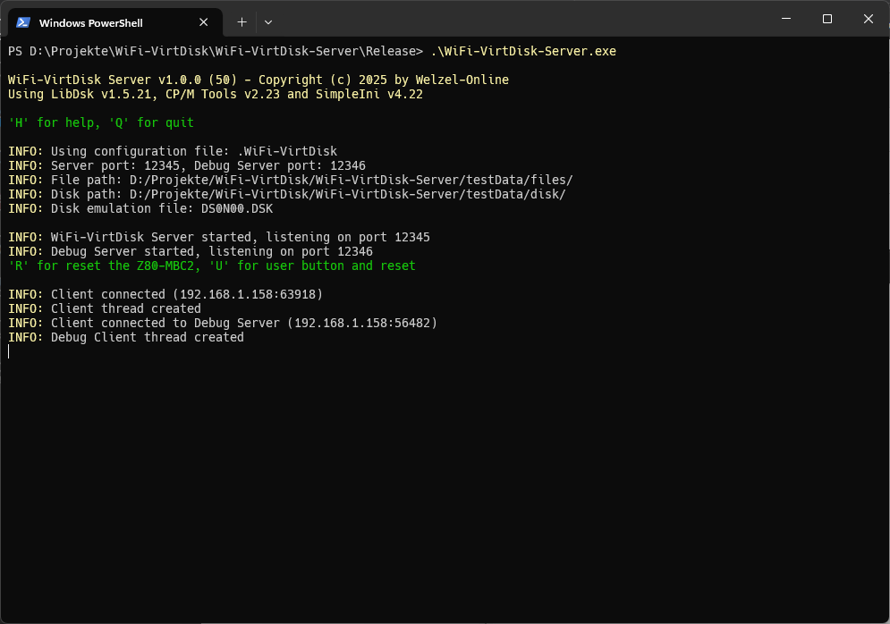
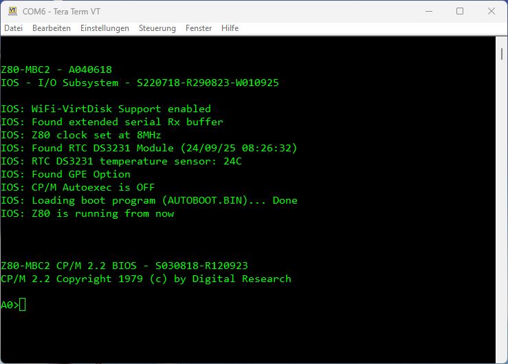

# Handbuch WiFi-VirtDisk (Kurzanleitung)

Autor: Chrisitan Welzel (https://www.welzel-online.ch)

Die WiFi-VirtDisk für den Z80-MBC2 kann als Ersatz für die SD-Karte am Z80-MBC2 angeschlossen werden. Hierbei wird aber nicht das SD-Kartenprotokoll emuliert, sondern ein eigenes Protokoll zur Kommunikation mit einem ESP8266 verwendet. Dieser ESP8266 verbindet sich über WLAN mit einer Server-Software, welche dann die Disketten-Images bereitstellt. Der Server ermöglicht es, den gesamten SD-Karteninhalt in einem Verzeichnis zu verwalten. Zusätzlich kann eine einzelne Diskette in einem Verzeichnis emuliert werden. Dies wird durch die Verwendung von **libdsk** ermöglicht.

## Installation

Die WiFi-VirtDisk besteht aus drei Teilen, welche für die unterschiedlichen Aufgaben erstellt wurden.
* IOS für Z80-MBC2 mit WiFi-VirtDisk Support
* WiFi-VirtDisk Client (ESP8266)
* WiFi-VirtDisk Server (PC mit Windows oder Linux)

Nach dem Clonen des Repositories von GitHub können das MBC2 IOS und der WiFi-VirtDisk Client mit der Arduino IDE (getestet mit v2.3.6) kompiliert werden.

Für den WiFi-VirtDisk Client werden die Bibliotheken **WiFiManager** von *tzapu* und **DoubleResetDetector** von *Stephen Denne* benötigt, welche über den Bibliotheks-Manager installiert werden können.

Der WiFi-VirtDisk Server wurde mit Visual Studio Code und WinLibs (https://winlibs.com) unter Windows 11 erstellt. Hierzu wird am besten das CMake Plugin verwendet.

## Inbetriebnahme

Der **WiFi-VirtDisk Client** sollte nach Schaltplan an den SD-Kartenport des Z80-MBC2 angeschlossen werden. Die Debug-Funktionen zum betätigen des Reset- und User-Buttons sind optional.

> **5V Versorgungsspannung beachten! Die 5V des PCs (USB) dürfen nicht mit den 5V (extern) des Z80-MBC2 verbunden werden! Nur die Masseverbindung ist erorderlich!**

> Der WiFi-VirtDisk Client kann mit einem USB-Kabel am PC angeschlossen werden und stellt dann einen COM-Port bereit. Dieser ist mit 115200 Baud, 8N1, konfiguriert und zeigt Informationen zum Zustand an.

Beim ersten Start des WiFI-VirtDisk Clients (ESP8266) ist dieser nicht konfiguriert. Dies wird durch ein schnelles Blinken der LED angezeigt. Er befindet sich dann im Access Point Modus und stellt ein eigenes WLAN mit der SSID **WiFi-VirtDisk Client AP** zur Verfügung. Mit einem Webbrowser kann dann unter der IP-Adresse **http://192.168.4.1** das Konfigurations-Portal aufgerufen werden.

<figure>
    
</figure>

Hier kann jetzt das eigene WLAN (SSID) ausgewählt und das Passwort gesetzt werden.

Zusätzlich wird hier die IP-Adresse des WiFi-VirtDisk Servers, sowie der Port (Standard: 12345) festgelegt. Der Port des Debug-Servers ist immer eine Nummer höher (Standard: 12346).

<figure>
    
</figure>

Nach erfolgreichem Speichern sollte sich der Client mit dem konfigurierten WLAN verbinden. Während des Verbindungsaufbaus blinkt die LED langsam. Ist die Verbindung hergestellt leuchtet die LED dauerhaft.

Danach versucht der WiFi-VirtDisk Client sich mit dem Server zu verbinden.

Der **WiFi-VirtDisk Server** wird in einem Terminal gestartet und benötigt eine Port-Freigabe für den Haupt-Port und den Debug-Port.

<figure>
    
</figure>

Der Server liest beim start die Konfiguration aus der Datei ".WiFi-VirtDisk" im selben Verzeichnis. Diese ist im INI-Dateiformat.

    [WiFi-VirtDisk]
    serverPort=12345

    filePath=D:/Projekte/WiFi-VirtDisk/WiFi-VirtDisk-Server/testData/files/
    diskPath=D:/Projekte/WiFi-VirtDisk/WiFi-VirtDisk-Server/testData/disk/

    diskEmuFilename=DS0N00.DSK

#### Beschreibung der Parameter

| Parameter       | Beschreibung                                                              |
|-----------------|---------------------------------------------------------------------------|
| serverPort      | Der Port des WiFi-VirtDisk Servers.                                       |
| filePath        | In diesem Verzeichnis liegen die Dateien (Disk-Images) der SD-Karte.      |
| diskPath        | In diesem Verzeichnis werden die Dateien für die Disk-Emulation abgelegt. |
| diskEmuFilename | Dieses Disk-Image wird durch den Server emuliert.                         |

> Im Moment kann nur das Disk-Image *DS0N00.DSK* emuliert werden, da dessen Geometrie (CP/M 2.2, System-Spur) fest hinterlegt ist!

Nach dem Start des Servers gibt dieser Informationen zur Konfiguration und der Ports aus. Wenn ein Client eine Verbindung aufbaut, wird dies angezeigt. Weiterhin gibt der Server Informationen zu den ausgeführten Befehlen und angeforderten Daten aus.

## Einfacher Start

Für einen einfachen Start empfielt es sich, dass der komplette Inhalt des SD-Karten Zip-Archives in den Ordner **filePath** entpackt wird und der **diskEmuFilename** leer gelassen wird.

    diskEmuFilename=

Mit dieser Konfiguration verhält sich der Z80-MBC2 wie mit einer SD-Karte.

<!-- 

 -->

## Entwicklung für den Z80-MBC2

Die Entwicklung von Anwendungen für CP/M 2.2 wird stark vereinfacht, wenn ein Disk-Image emuliert wird. Auf diese Weise können Programme, welche unter Windows crosskompiliert wurden, direkt nach dem Erstellen in das Verzeichnis des emulierten Disk-Images kopiert werden. Sie stehen dann sofort unter CP/M zur Verfügung und es entfällt das kopieren auf SD-Karte oder das Hochladen mit XModem.

<figure>
    
</figure>

<figure>
    
</figure>
