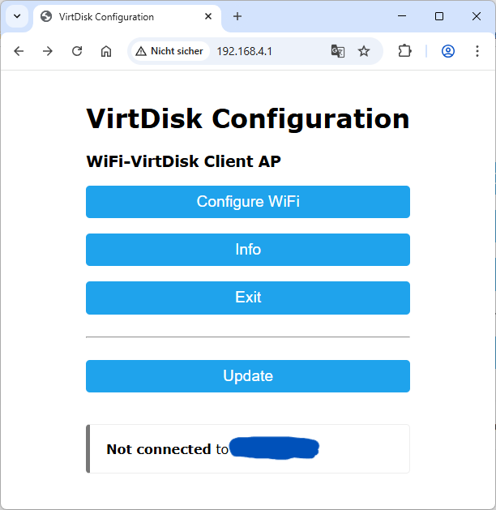
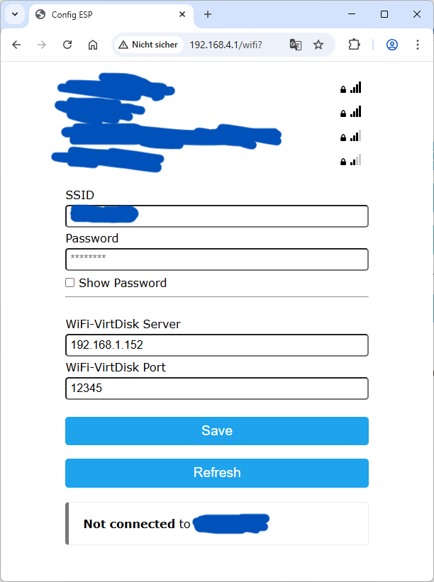
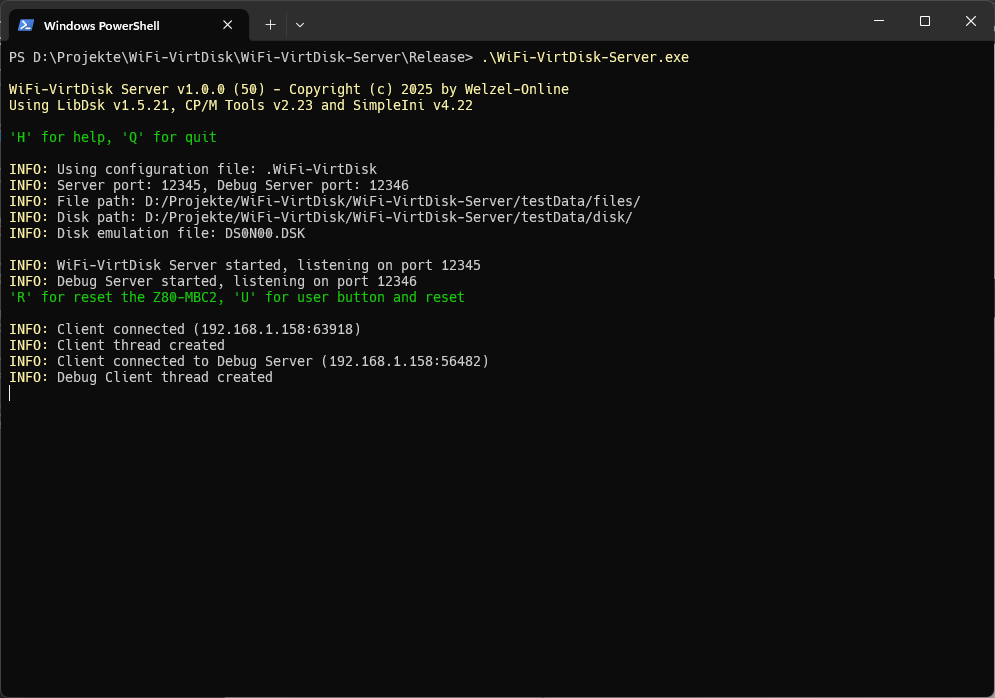
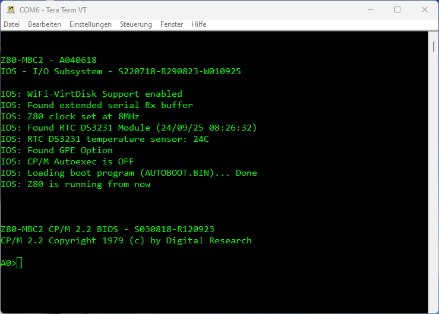

# WiFi-VirtDisk Manual (Quick Guide)

Author: Christian Welzel (https://www.welzel-online.ch)

The WiFi-VirtDisk for the Z80-MBC2 can be connected as a replacement for the SD card on the Z80-MBC2. However, the SD card protocol is not emulated; instead, a custom protocol is used to communicate with an ESP8266. This ESP8266 connects via WLAN to server software, which then provides the disk images. The server allows you to manage the entire SD card content in a directory. Additionally, a single disk can be emulated in a directory. This is made possible by using **libdsk**.

## Installation

The WiFi-VirtDisk consists of three parts, each created for different tasks:
* IOS for Z80-MBC2 with WiFi-VirtDisk support
* WiFi-VirtDisk Client (ESP8266)
* WiFi-VirtDisk Server (PC with Windows or Linux)

After cloning the repository from GitHub, the MBC2 IOS and the WiFi-VirtDisk Client can be compiled with the Arduino IDE (tested with v2.3.6).

For the WiFi-VirtDisk Client, the libraries **WiFiManager** by *tzapu* and **DoubleResetDetector** by *Stephen Denne* are required, which can be installed via the library manager.

The WiFi-VirtDisk Server was created with Visual Studio Code and WinLibs (https://winlibs.com) under Windows 11. It is best to use the CMake plugin for this.

## Commissioning

The **WiFi-VirtDisk Client** should be connected to the SD card port of the Z80-MBC2 according to the schematic. The debug functions for operating the reset and user buttons are optional.

> **Observe 5V supply voltage! The 5V from the PC (USB) must not be connected to the 5V (external) of the Z80-MBC2! Only the ground connection is required!**

> The WiFi-VirtDisk Client can be connected to the PC via USB cable and then provides a COM port. This is configured with 115200 baud, 8N1, and displays information about the status.

When the WiFi-VirtDisk Client (ESP8266) is started for the first time, it is not configured. This is indicated by a fast blinking LED. It then operates in Access Point mode and provides its own WLAN with the SSID **WiFi-VirtDisk Client AP**. You can then access the configuration portal with a web browser at the IP address **http://192.168.4.1**.

<figure>
    
</figure>

Here you can select your own WLAN (SSID) and set the password.

Additionally, the IP address of the WiFi-VirtDisk Server and the port (default: 12345) are set here. The debug server port is always one number higher (default: 12346).

<figure>
    
</figure>

After saving successfully, the client should connect to the configured WLAN. While connecting, the LED blinks slowly. Once the connection is established, the LED stays on.

Afterwards, the WiFi-VirtDisk Client tries to connect to the server.

The **WiFi-VirtDisk Server** is started in a terminal and requires a port release for the main port and the debug port.

<figure>
    
</figure>

On startup, the server reads the configuration from the file ".WiFi-VirtDisk" in the same directory. This file is in INI format.

    [WiFi-VirtDisk]
    serverPort=12345

    filePath=D:/Projekte/WiFi-VirtDisk/WiFi-VirtDisk-Server/testData/files/
    diskPath=D:/Projekte/WiFi-VirtDisk/WiFi-VirtDisk-Server/testData/disk/

    diskEmuFilename=DS0N00.DSK

#### Description of the parameters

| Parameter       | Description                                                                 |
|-----------------|------------------------------------------------------------------------------|
| serverPort      | The port of the WiFi-VirtDisk Server.                                       |
| filePath        | This directory contains the files (disk images) of the SD card.             |
| diskPath        | This directory contains the files for disk emulation.                       |
| diskEmuFilename | This disk image is emulated by the server.                                  |

> At the moment, only the disk image *DS0N00.DSK* can be emulated, as its geometry (CP/M 2.2, system track) is hardcoded!

After starting the server, it outputs information about the configuration and the ports. When a client connects, this is displayed. The server also outputs information about the executed commands and requested data.

## Simple Start

For a simple start, it is recommended to extract the entire contents of the SD card zip archive into the **filePath** folder and leave **diskEmuFilename** empty.

    diskEmuFilename=

With this configuration, the Z80-MBC2 behaves as if it had an SD card.

<!-- 

 -->

## Development for the Z80-MBC2

Developing applications for CP/M 2.2 is greatly simplified when a disk image is emulated. In this way, programs cross-compiled under Windows can be copied directly into the directory of the emulated disk image after creation. They are then immediately available under CP/M, eliminating the need to copy to an SD card or upload via XModem.

<figure>
    
</figure>

<figure>
    
</figure>
