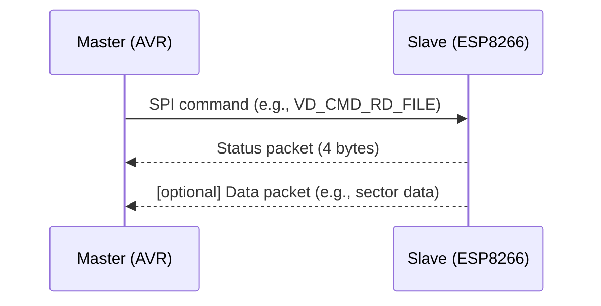
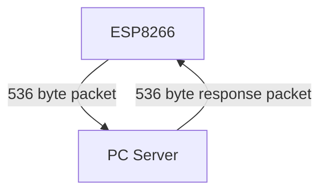

# Protocol Definitions

## Table of Contents
- [1. SPI Protocol (AVR ↔ ESP8266)](#1-spi-protocol-avr-↔-esp8266)
  - [1.1 Overview](#11-overview)
  - [1.2 Packet Structure](#12-packet-structure)
  - [1.3 Checksum](#13-checksum)
  - [1.4 ESP8266-specific SPI Prefix Bytes](#14-esp8266-specific-spi-prefix-bytes)
  - [1.5 Sequence and Example](#15-sequence-and-example)
  - [1.6 Notes](#16-notes)
- [2. TCP Protocol (ESP8266 ↔ PC Server)](#2-tcp-protocol-esp8266-↔-pc-server)
  - [2.1 Overview](#21-overview)
  - [2.2 Packet Structure](#22-packet-structure)
  - [2.3 Commands](#23-commands)
  - [2.4 Status and Error Codes](#24-status-and-error-codes)
  - [2.5 Sequence and Example](#25-sequence-and-example)
  - [2.6 Notes](#26-notes)

---

# 1. SPI Protocol (AVR ↔ ESP8266)

## 1.1 Overview
The SPI protocol connects the AVR microcontroller (master) with the ESP8266 (slave). It is used for transferring floppy disk commands and data. Communication is packet-based, uses fixed lengths, and a simple checksum for error detection.

 

## 1.2 Packet Structure

### SPI Data Packet (Master → Slave)
- **Maximum length:** 32 bytes
- **Actual length:** Varies depending on the command (see table below)

#### General Structure (varies by command):
| Byte Range | Meaning                |
|------------|------------------------|
| 0          | Command (`cmd`)        |
| 1..n       | Parameters/Data        |
| ...        | ...                    |
| Last Byte  | Checksum               |

#### Overview of SPI Commands and Packet Lengths
The commands are defined as `enum vdCommands`:

| Command         | Code  | Typical Packet Length | Fields in Packet (Order)                                   | Description                |
|-----------------|-------|----------------------|------------------------------------------------------------|----------------------------|
| VD_CMD_NONE     | 0x00  | 1                    | cmd, checksum                                              | No command                 |
| VD_CMD_STATUS   | 0x01  | 2                    | cmd, status, checksum                                      | Query status               |
| VD_CMD_SEL_FILE | 0x02  | 15                   | cmd, filename[13], checksum                                | Select file                |
| VD_CMD_RD_FILE  | 0x03  | 4                    | cmd, offset, length, checksum                              | Read file                  |
| VD_CMD_RD_NEXT  | 0x04  | 3                    | cmd, length, checksum                                      | Read next data             |
| VD_CMD_WR_FILE  | 0x05  | 20                   | cmd, offset, length, data[16], checksum                    | Write file                 |
| VD_CMD_WR_NEXT  | 0x06  | 3                    | cmd, length, checksum                                      | Write more data            |
| VD_CMD_SEEK_FILE| 0x07  | 6                    | cmd, offset[4], checksum                                   | Set file position          |
| VD_CMD_SEL_TR_SEC| 0x08 | 0                    | not used                                                   | Select track/sector        |
| VD_CMD_RD_SECTOR| 0x09  | 0                    | not used                                                   | Read sector                |
| VD_CMD_WR_SECTOR| 0x0A  | 0                    | not used                                                   | Write sector               |

**The SPI packet is always padded to 32 bytes by the slave (ESP8266) if less is transmitted. Unused bytes are filled with 0x00.**

 

### SPI Response Packets (Slave → Master)

The SPI slave (ESP8266) responds to many commands not only with a status packet but—depending on the command—also with data packets.

- **Maximum length:** 32 bytes
- **Actual length:** Varies depending on the command (see table below)

 The type of response depends on the command:

- **Status query:** Response is a 4-byte status packet.
- **Read commands (e.g., VD_CMD_RD_FILE):** The master polls the status of the slave until it is ready. Then it reads the data packet with payload (e.g., read sector data).
- **Write commands:** Confirmation via status packet.

#### Response Data Packet (Slave → Master)
- **Length:** Variable, depending on command and data amount (e.g., 16 or 512 bytes payload, possibly split across multiple packets)
- **Structure:**
  | Byte Range | Meaning         |
  |------------|----------------|
  | 0          | Command (`cmd`) |
  | 1..n       | Data (payload)  |
  | ...        | ...             |
  | Last Byte  | Checksum        |

#### Status Packet (Slave → Master)
- **Length:** 4 bytes (always fixed)
- **Structure:**
  | Byte | Meaning                          |
  |------|----------------------------------|
  | 0    | SPI Status (Ready/Busy/Error)     |
  | 1    | Status of last command            |
  | 2    | Data of last command              |
  | 3    | Free (0x00)                       |

- **Byte 0:** SPI Status
  - 0x00: Ready (SPISLAVE_READY)
  - 0x01: Busy (SPISLAVE_BUSY)
  - 0x02: Checksum Error (SPISLAVE_CHKSUM_ERR)
- **Byte 1:** Status of last command (e.g., VD_STATUS_OK, VD_STATUS_ERROR, VD_STATUS_FILE_NOT_FOUND)
- **Byte 2:** Data/function-specific
- **Byte 3:** Free (0x00)

#### Packet Diagram

 

## 1.3 Checksum
The checksum is the simple sum of all bytes (including command and data). The transmission is valid if the sum of all bytes (including the checksum) is 0 (`checksum == 0`).

 

## 1.4 ESP8266-specific SPI Prefix Bytes

### Overview
For every SPI communication with the ESP8266 as slave, special prefix bytes must be sent before the actual protocol command. These serve to distinguish whether it is a data, status, or control command and are specified by the implementation of the ESP8266 SPI slave library (e.g., `hspi_slave.c`/`SPISlave.h`).

### Prefix Bytes
Before each actual protocol packet, **two bytes** are sent:

| Byte | Meaning           | Value (Example)         |
|------|-------------------|------------------------|
| 0    | SPI command type  | e.g., 0x02 = Write Data|
| 1    | Dummy/Zero        | 0x00                   |

**Only after this** does the actual protocol packet follow (e.g., the floppy command and payload).

#### Typical SPI Command Types (Prefix Byte 0):
| Value | Meaning         |
|-------|----------------|
| 0x02  | Write Data     |
| 0x03  | Read Data      |
| 0x04  | Read Status    |
| 0x01  | Write Status   |

These values are defined in the file `virtDisk.h` as `SPI_WR_DATA`, `SPI_RD_DATA`, `SPI_RD_STATUS`, `SPI_WR_STATUS` and are always sent as the first byte in communication.

### Where do these bytes come from?
The prefix bytes are specified by the architecture of the ESP8266 SPI slave implementation. The library expects these commands to distinguish between data and status transfers. See the official documentation and source code of the ESP8266 Arduino Core SPI slave library ([ESP8266 Arduino SPI Slave](https://github.com/esp8266/Arduino/blob/master/libraries/SPISlave/src/hspi_slave.c)).

**Example:**
When sending a floppy command, the transmission looks like this:

1. `0x02` (Write Data)
2. `0x00` (Dummy)
3. ...Protocol packet (e.g., `VD_CMD_RD_FILE`, parameters, checksum)

**Only if these prefix bytes are set correctly will the ESP8266 process the packet correctly!**

 

## 1.5 Sequence and Example
1. Master sets chip select and sends a 32-byte packet.
2. Slave checks checksum, processes the command, and sets status.
3. Master polls the status (4 bytes) until the slave reports "Ready".
4. Master checks command and data status.

### Example: Read File
1. Master sends `VD_CMD_RD_FILE` with filename, offset, and desired data length.
2. Slave checks checksum, processes the command, and prepares response data.
3. Status packet indicates how many bytes were read and whether an error occurred.

## 1.6 Notes
- All packets are packed with `#pragma pack(1)`, no padding bytes.
- Filenames are in 8.3 format (max. 13 bytes including null terminator).
- SPI communication is blocking: The slave remains "Busy" until the command is processed.

---

# 2. TCP Protocol (ESP8266 ↔ PC Server)

## 2.1 Overview
The TCP protocol connects the ESP8266 client with the PC server. It transfers the floppy commands and data 1:1. The packets are identical to the SPI protocol, but larger data amounts (e.g., 512 byte sectors) can be transferred.

## 2.2 Packet Structure
- **Structure:**
  | Field       | Type         | Description                |
  |-------------|-------------|----------------------------|
  | cmd         | uint8_t      | Command                    |
  | status      | int8_t       | Status                     |
  | filename    | char[13]     | Filename (8.3)             |
  | fileOffset  | uint32_t     | Offset for SEEK            |
  | track       | uint16_t     | Track                      |
  | sector      | uint8_t      | Sector                     |
  | data        | uint8_t[512] | Data buffer                |
  | dataLen     | uint16_t     | Length of valid data       |

- **Total length:** 536 bytes per packet

#### Packet Diagram

## 2.3 Commands
The commands correspond to the SPI protocol (`enum vdCommands`):

| Value | Name           | Description                |
|-------|----------------|---------------------------|
| 0x00  | NONE           | No command                |
| 0x01  | STATUS         | Query status              |
| 0x02  | SEL_FILE       | Select file               |
| 0x03  | RD_FILE        | Read file                 |
| 0x04  | RD_NEXT        | Read next data            |
| 0x05  | WR_FILE        | Write file                |
| 0x06  | WR_NEXT        | Write more data           |
| 0x07  | SEEK_FILE      | Set file position         |
| 0x08  | SEL_TR_SEC     | Select track/sector       |
| 0x09  | RD_SECTOR      | Read sector               |
| 0x0A  | WR_SECTOR      | Write sector              |

## 2.4 Status and Error Codes
- **Status (int8_t status):**
  - 0: OK
  - 1: ERROR
  - 2: FILE_NOT_FOUND
  - 3: FILE_RD_ERROR
  - 4: DISK_NOT_FOUND
  - 5: TR_SEC_ERROR
  - 6: SEC_RD_ERROR
  - 7: SEC_WR_ERROR

## 2.5 Sequence and Example
1. Client establishes TCP connection to server.
2. Client sends a 536-byte packet with floppy command.
3. Server processes the command and sends a response packet back.
4. Client evaluates status and data.

### Example: Read Sector
1. Client sends `VD_CMD_RD_SECTOR` with track, sector, and desired length.
2. Server reads sector and sends data back.
3. Client checks status and processes data.

## 2.6 Notes
- The packets are packed with `#pragma pack(1)`, no padding bytes.
- The TCP connection remains open for multiple commands.
- Error codes are returned in the status field.

---

*Last update: 12.11.2025*