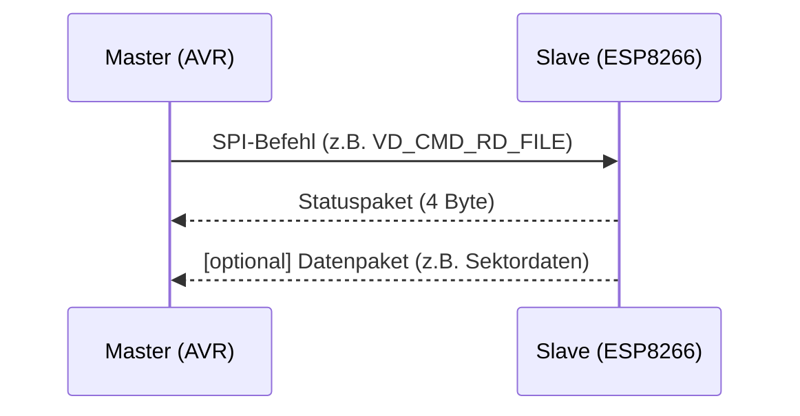
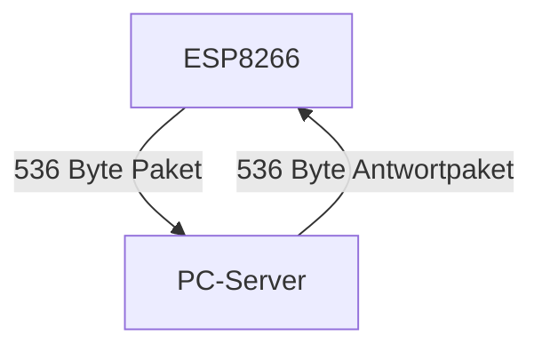

# Protokoll Definitionen

## Inhaltsverzeichnis
- [1. SPI-Protokoll (AVR ↔ ESP8266)](#1-spi-protokoll-avr-↔-esp8266)
  - [1.1 Übersicht](#11-übersicht)
  - [1.2 Paketaufbau](#12-paketaufbau)
  - [1.3 Checksumme](#13-checksumme)
  - [1.4 ESP8266-spezifische SPI-Prefix-Bytes](#14-esp8266-spezifische-spi-prefix-bytes)
  - [1.5 Ablauf und Beispiel](#15-ablauf-und-beispiel)
  - [1.6 Hinweise](#16-hinweise)
- [2. TCP-Protokoll (ESP8266 ↔ PC-Server)](#2-tcp-protokoll-esp8266-↔-pc-server)
  - [2.1 Übersicht](#21-übersicht)
  - [2.2 Paketaufbau](#22-paketaufbau)
  - [2.3 Kommandos](#23-kommandos)
  - [2.4 Status und Fehlercodes](#24-status-und-fehlercodes)
  - [2.5 Ablauf und Beispiel](#25-ablauf-und-beispiel)
  - [2.6 Hinweise](#26-hinweise)

---

# 1. SPI-Protokoll (AVR ↔ ESP8266)

## 1.1 Übersicht
Das SPI-Protokoll verbindet den AVR-Mikrocontroller (Master) mit dem ESP8266 (Slave). Es dient der Übertragung von Diskettenbefehlen und -daten. Die Kommunikation ist paketbasiert und verwendet feste Längen sowie eine einfache Checksumme zur Fehlererkennung.

 

## 1.2 Paketaufbau

### SPI-Datenpaket (Master → Slave)
- **Maximale Länge:** 32 Bytes
- **Tatsächliche Länge:** Variiert je nach Befehl (siehe Tabelle unten)

#### Allgemeiner Aufbau (je nach Befehl unterschiedlich belegt):
| Byte-Bereich | Bedeutung                |
|--------------|--------------------------|
| 0            | Kommando (`cmd`)         |
| 1..n         | Parameter/Daten          |
| ...          | ...                      |
| Letztes Byte | Checksumme               |

#### Übersicht der SPI-Kommandos und Paketlängen
Die Kommandos sind als `enum vdCommands` definiert:

| Befehl         | Code  | Typische Paketlänge | Felder im Paket (Reihenfolge)                                   | Beschreibung                |
|----------------|-------|---------------------|-----------------------------------------------------------------|----------------------------|
| VD_CMD_NONE           | 0x00  | 1                   | cmd, checksum                                                   | Kein Befehl                |
| VD_CMD_STATUS         | 0x01  | 2                   | cmd, status, checksum                                           | Status abfragen            |
| VD_CMD_SEL_FILE       | 0x02  | 15                  | cmd, filename[13], checksum                                     | Datei auswählen            |
| VD_CMD_RD_FILE        | 0x03  | 4                   | cmd, offset, length, checksum                     | Datei lesen                |
| VD_CMD_RD_NEXT        | 0x04  | 3                   | cmd, length, checksum                                           | Nächste Daten lesen        |
| VD_CMD_WR_FILE        | 0x05  | 20                  | cmd, offset, length, data[16], checksum           | Datei schreiben            |
| VD_CMD_WR_NEXT        | 0x06  | 3                   | cmd, length, checksum                                 | Weitere Daten schreiben    |
| VD_CMD_SEEK_FILE      | 0x07  | 6                   | cmd, offset[4], checksum                                        | Dateiposition setzen       |
| VD_CMD_SEL_TR_SEC     | 0x08  | 0                   | not used              | Track/Sektor wählen        |
| VD_CMD_RD_SECTOR      | 0x09  | 0                   | not used              | Sektor lesen               |
| VD_CMD_WR_SECTOR      | 0x0A  | 0                   | not used              | Sektor schreiben           |

**Das SPI-Paket wird vom Slave (ESP8266) immer auf 32 Bytes aufgefüllt, falls weniger übertragen werden. Nicht genutzte Bytes werden mit 0x00 gefüllt.**

 

### SPI-Antwortpakete (Slave → Master)

Der SPI-Slave (ESP8266) antwortet auf viele Kommandos nicht nur mit einem Statuspaket, sondern – je nach Befehl – auch mit Datenpaketen.

- **Maximale Länge:** 32 Bytes
- **Tatsächliche Länge:** Variiert je nach Befehl (siehe Tabelle unten)

 Die Art der Antwort hängt vom jeweiligen Kommando ab:

- **Statusabfrage:** Antwort ist ein 4-Byte-Statuspaket.
- **Lese-Befehle (z.B. VD_CMD_RD_FILE):** Der Master pollt den Status des Slave so lange, bis dieser bereit (ready) ist. Danach liest er das Datenpaket mit Nutzdaten (z.B. gelesene Sektordaten).
- **Schreib-Befehle:** Bestätigung über Statuspaket.

#### Antwort-Datenpaket (Slave → Master)
- **Länge:** Variabel, je nach Befehl und Datenmenge (z.B. 16 oder 512 Bytes Nutzdaten, ggf. aufgeteilt auf mehrere Pakete)
- **Struktur:**
  | Byte-Bereich | Bedeutung         |
  |--------------|-------------------|
  | 0            | Kommando (`cmd`)  |
  | 1..n         | Daten (Nutzdaten) |
  | ...          | ...               |
  | Letztes Byte | Checksumme        |

#### Statuspaket (Slave → Master)
- **Länge:** 4 Bytes (immer fest)
- **Struktur:**
  | Byte | Bedeutung                        |
  |------|----------------------------------|
  | 0    | SPI Status (Ready/Busy/Error)    |
  | 1    | Status des letzten Kommandos     |
  | 2    | Daten des letzten Kommandos      |
  | 3    | Frei (0x00)                      |

- **Byte 0:** SPI Status
  - 0x00: Ready (SPISLAVE_READY)
  - 0x01: Busy (SPISLAVE_BUSY)
  - 0x02: Checksum Error (SPISLAVE_CHKSUM_ERR)
- **Byte 1:** Status des letzten Kommandos (z.B. VD_STATUS_OK, VD_STATUS_ERROR, VD_STATUS_FILE_NOT_FOUND)
- **Byte 2:** Daten/Funktionsspezifisch
- **Byte 3:** Frei (0x00)

#### Paketgrafik

 

## 1.3 Checksumme
Die Checksumme ist die einfache Summe aller Bytes (inkl. Kommando und Daten). Die Übertragung ist gültig, wenn die Summe aller Bytes (inkl. Checksumme) 0 ergibt (`checksum == 0`).

 

## 1.4 ESP8266-spezifische SPI-Prefix-Bytes

### Übersicht
Bei jeder SPI-Kommunikation mit dem ESP8266 als Slave müssen vor dem eigentlichen Protokollkommando spezielle Prefix-Bytes gesendet werden. Diese dienen der Unterscheidung, ob es sich um einen Daten-, Status- oder Steuerbefehl handelt und sind durch die Implementierung der ESP8266 SPI-Slave-Bibliothek (z.B. `hspi_slave.c`/`SPISlave.h`) vorgegeben.

### Prefix-Bytes
Vor jedem eigentlichen Protokollpaket werden **zwei Bytes** gesendet:

| Byte | Bedeutung         | Wert (Beispiel)         |
|------|-------------------|------------------------|
| 0    | SPI-Befehlstyp    | z.B. 0x02 = Write Data |
| 1    | Dummy/Zero        | 0x00                   |

**Erst danach** folgt das eigentliche Protokollpaket (z.B. das Diskettenkommando und die Nutzdaten).

#### Typische SPI-Befehlstypen (Prefix-Byte 0):
| Wert  | Bedeutung         |
|-------|------------------|
| 0x02  | Write Data       |
| 0x03  | Read Data        |
| 0x04  | Read Status      |
| 0x01  | Write Status     |

Diese Werte sind in der Datei `virtDisk.h` als `SPI_WR_DATA`, `SPI_RD_DATA`, `SPI_RD_STATUS`, `SPI_WR_STATUS` definiert und werden in der Kommunikation immer als erstes Byte gesendet.

### Woher kommen diese Bytes?
Die Prefix-Bytes sind durch die Architektur der ESP8266 SPI-Slave-Implementierung vorgegeben. Die Bibliothek erwartet diese Kommandos, um zwischen Daten- und Statusübertragungen zu unterscheiden. Siehe dazu die offizielle Dokumentation und Quelltexte der ESP8266 Arduino Core SPI-Slave-Bibliothek ([ESP8266 Arduino SPI Slave](https://github.com/esp8266/Arduino/blob/master/libraries/SPISlave/src/hspi_slave.c)).

**Beispiel:**
Beim Senden eines Diskettenkommandos sieht die Übertragung so aus:

1. `0x02` (Write Data)
2. `0x00` (Dummy)
3. ...Protokollpaket (z.B. `VD_CMD_RD_FILE`, Parameter, Checksumme)

**Nur wenn diese Prefix-Bytes korrekt gesetzt sind, wird das Paket vom ESP8266 korrekt verarbeitet!**

 

## 1.5 Ablauf und Beispiel
1. Master setzt Chip Select und sendet ein 32-Byte-Paket.
2. Slave prüft Checksumme, verarbeitet das Kommando und setzt Status.
3. Master pollt den Status (4 Byte), bis der Slave "Ready" meldet.
4. Master prüft Kommando- und Datenstatus.

### Beispiel: Datei lesen
1. Master sendet `VD_CMD_RD_FILE` mit Dateiname, Offset und gewünschter Datenlänge.
2. Slave prüft Checksumme, verarbeitet das Kommando und bereitet Antwortdaten vor.
3. Statuspaket gibt an, wie viele Bytes gelesen wurden und ob ein Fehler auftrat.

## 1.6 Hinweise
- Alle Pakete sind mit `#pragma pack(1)` gepackt, keine Padding-Bytes.
- Dateinamen sind im 8.3-Format (max. 13 Bytes inkl. Nullterminator).
- Die SPI-Kommunikation ist blockierend: Der Slave bleibt "Busy", bis das Kommando abgearbeitet ist.

---

# 2. TCP-Protokoll (ESP8266 ↔ PC-Server)

## 2.1 Übersicht
Das TCP-Protokoll verbindet den ESP8266-Client mit dem PC-Server. Es überträgt die Diskettenbefehle und -daten 1:1 weiter. Die Pakete sind identisch zum SPI-Protokoll, jedoch können größere Datenmengen (z.B. 512 Byte Sektoren) übertragen werden.

## 2.2 Paketaufbau
- **Struktur:**
  | Feld         | Typ         | Beschreibung                |
  |--------------|-------------|-----------------------------|
  | cmd          | uint8_t     | Befehl                      |
  | status       | int8_t      | Status                      |
  | filename     | char[13]    | Dateiname (8.3)             |
  | fileOffset   | uint32_t    | Offset für SEEK             |
  | track        | uint16_t    | Track                       |
  | sector       | uint8_t     | Sektor                      |
  | data         | uint8_t[512]| Datenpuffer                 |
  | dataLen      | uint16_t    | Länge der gültigen Daten    |

- **Gesamtlänge:** 536 Bytes pro Paket

#### Paketgrafik

## 2.3 Kommandos
Die Kommandos entsprechen dem SPI-Protokoll (`enum vdCommands`):

| Wert  | Name           | Beschreibung                |
|-------|----------------|----------------------------|
| 0x00  | NONE           | Kein Befehl                |
| 0x01  | STATUS         | Status abfragen            |
| 0x02  | SEL_FILE       | Datei auswählen            |
| 0x03  | RD_FILE        | Datei lesen                |
| 0x04  | RD_NEXT        | Nächste Daten lesen        |
| 0x05  | WR_FILE        | Datei schreiben            |
| 0x06  | WR_NEXT        | Weitere Daten schreiben    |
| 0x07  | SEEK_FILE      | Dateiposition setzen       |
| 0x08  | SEL_TR_SEC     | Track/Sektor wählen        |
| 0x09  | RD_SECTOR      | Sektor lesen               |
| 0x0A  | WR_SECTOR      | Sektor schreiben           |

## 2.4 Status und Fehlercodes
- **Status (int8_t status):**
  - 0: OK
  - 1: ERROR
  - 2: FILE_NOT_FOUND
  - 3: FILE_RD_ERROR
  - 4: DISK_NOT_FOUND
  - 5: TR_SEC_ERROR
  - 6: SEC_RD_ERROR
  - 7: SEC_WR_ERROR

## 2.5 Ablauf und Beispiel
1. Client baut TCP-Verbindung zum Server auf.
2. Client sendet ein 536-Byte-Paket mit Diskettenbefehl.
3. Server verarbeitet das Kommando und sendet Antwortpaket zurück.
4. Client wertet Status und Daten aus.

### Beispiel: Sektor lesen
1. Client sendet `VD_CMD_RD_SECTOR` mit Track, Sektor und gewünschter Länge.
2. Server liest Sektor und sendet Daten zurück.
3. Client prüft Status und übernimmt Daten.

## 2.6 Hinweise
- Die Pakete sind mit `#pragma pack(1)` gepackt, keine Padding-Bytes.
- Die TCP-Verbindung bleibt für mehrere Befehle offen.
- Fehlercodes werden im Statusfeld zurückgegeben.

---

*Letzte Aktualisierung: 12.11.2025*
